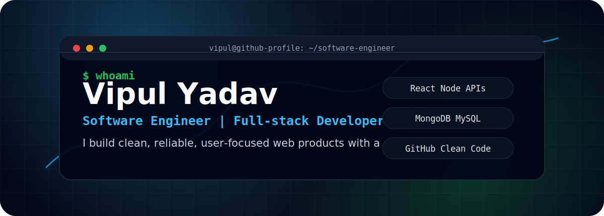
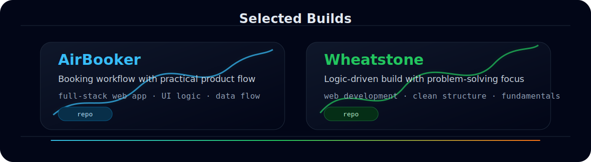

<p align="center">
  
</p>

<p align="center">
  
</p>

<p align="center">
  <a href="https://github.com/vipulyadav29">
    
  </a>
  <a href="https://github.com/vipulyadav29?tab=followers">
    
  </a>
  <a href="mailto:satyavipul11@gmail.com">
    
  </a>
</p>

<p align="center">
  
</p>

## System profile

```txt
role        Software Engineer
focus       Full-stack web development, APIs, product workflows
principles  Clear code, useful UX, maintainable systems
status      Building, learning, and improving in public
```

I am a software engineer who enjoys turning ideas into practical products. I like working across the stack: shaping the user experience, designing clean APIs, connecting data, and keeping the codebase understandable as the project grows.

- Currently focused on full-stack development, backend fundamentals, and modern web engineering.
- Interested in web apps, automation, APIs, developer tools, and real-world product workflows.
- I value readable code, good naming, simple architecture, and consistent improvement.
- Open to collaborating on practical projects with clear goals and real users.

<p align="center">
  
</p>

## Toolbox

<p align="center">
  
</p>

<p align="center">
  
  
  
  
</p>

<p align="center">
  
</p>

## Engineering style

```txt
simple first      Build the smallest clean solution that solves the real problem.
user aware        Make software feel clear, fast, and useful.
maintainable      Keep structure readable so future changes feel natural.
always improving  Use every project to sharpen fundamentals and taste.
```

<p align="center">
  
</p>

## Featured work

<p align="center">
  
</p>

<table>
  <tr>
    <th>Project</th>
    <th>Focus</th>
    <th>Stack</th>
  </tr>
  <tr>
    <td><a href="https://github.com/vipulyadav29/AirBooker"><b>AirBooker</b></a></td>
    <td>Booking workflow, user-focused interface, and practical product flow</td>
    <td>Full-stack web app</td>
  </tr>
  <tr>
    <td><a href="https://github.com/vipulyadav29/Wheatstone"><b>Wheatstone</b></a></td>
    <td>Logic-driven implementation with clean structure and problem-solving focus</td>
    <td>Web development</td>
  </tr>
  <tr>
    <td><b>More projects soon</b></td>
    <td>Continuing to build, polish, and publish stronger engineering work</td>
    <td>Learning in public</td>
  </tr>
</table>

<p align="center">
  
</p>

## GitHub activity

<p align="center">
  
  
</p>

<p align="center">
  
</p>

<p align="center">
  
</p>

<p align="center">
  
</p>

## Connect with me

<p align="center">
  <a href="https://www.linkedin.com/in/vipul29">
    
  </a>
  <a href="mailto:satyavipul11@gmail.com">
    
  </a>
</p>
